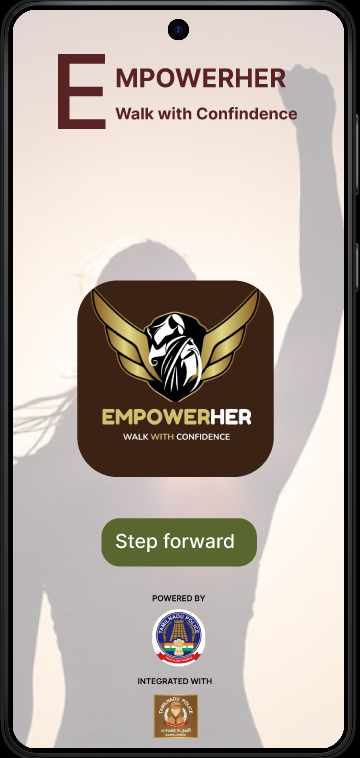
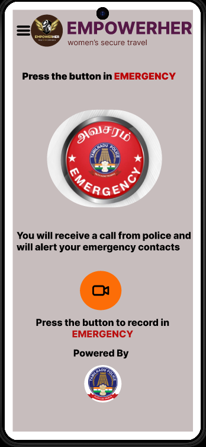
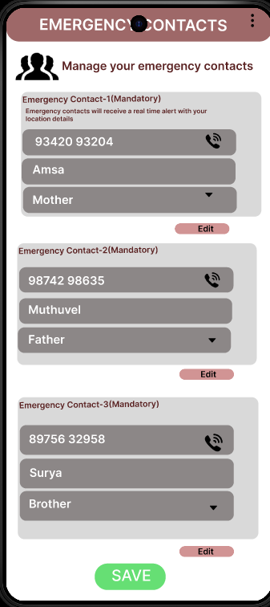

# EmpowerHER – Women's Safety Application

## Overview

EmpowerHER is a women's safety mobile application prototype developed during a hackathon organized by the **Thoothukudi Police Department**. The application was designed to provide quick access to emergency assistance through SOS alerts, live location sharing, emergency contact notifications, and safety resources.

## Achievement

🏆 Selected for the **Final Round**, ranking among the **Top 19 teams out of 370 participating teams**.

## Features

* SOS Emergency Alert
* Live Location Sharing
* Emergency Contact Management
* Safety Resources
* User-Friendly Interface

## Tools Used

* Figma
* UI/UX Design
* Prototyping

## Figma Prototype

https://www.figma.com/proto/2lYSQRa44xV4bKj5ErOASM

## Screenshots

### Home Screen

### SOS Screen

### Emergency Contacts Screen

